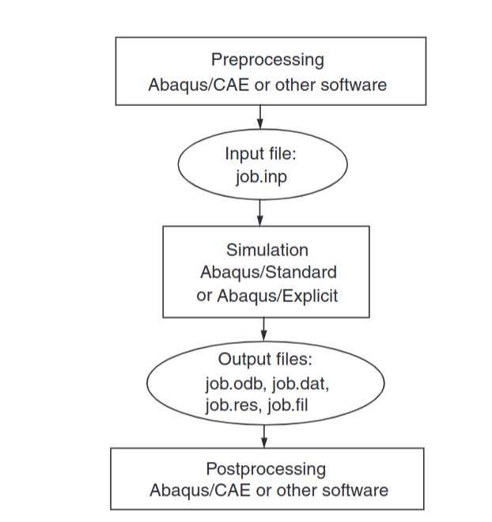

# What is Abaqus?

[Abaqus](https://en.wikipedia.org/wiki/Abaqus) is a software suite for finite element analysis and computer-aided engineering. It is used for
* modeling of mechanical components,
* analysis of mechanical components,
* visualizing the finite element analysis result.

Abaqus uses the open-source scripting language Python for scripting and customization. And in this article we will see, how we can write Python scripts to customize Abaqus.

# Quick Start

We will run the scripts directly from the Abaqus window. To use the scripts, do the following:

1. Open Abaqus/CAE or Abaqus/Viewer.
1. Click File / Run Script... and navigate to `extract.py`.
1. (Now you have a new file `extracted.csv` containing information from your field outputs.)
1. Click File / Run Script... and navigate to `fill.py`.
1. (Now you have a new file `enriched.csv` containing information from your field outputs plus new information computed with your Python script.)
1. Click File / Run Script... and navigate to `field_outputs.py`.
1. Click File / Open... and set the file filter to `Output Database (*.odb)` and navigate to your output database (at `ODB_PATH`).
1. Now, you have new field outputs corresponding to new lists of numbers computed in Python :)

In the rest of the article, we will dive more deeply into those three Python scripts and in what they do.

# Output databases

The standard Abaqus workflow looks like this: 

Now, let's look at a `job.odb` output file. This file represents an **output database**. An output database contains the results from your analysis. This output database contains the following things:
* Steps
* Frames
* Field Outputs

An output database can have several steps. Each step is named like `Step-1`. Each step consists of many frames. The frames are numbered like `0,1,2,3`. Each frame has several field outputs. Each field output has a name and list of numbers. The numbers are usually rational numbers with many digits after the comma.

Now, our job is to extract all field outputs from a specific frame from a specific step from a given output database. Our next job is to process those field outputs to create new information. Our last job is to create new field outputs containing that new information. Let's write a Python script to do that.

In this article, we deal with field outputs. If you want to learn more about history outputs instead, [see here](https://mafiadoc.com/accessing-abaqus-database-using-python-scripting_5c5d0f8a097c47812d8b4776.html).

# Field outputs

We will proceed in three steps.

1. First, in [extract.py](https://github.com/Jachtabahn/abaqus/blob/master/extract.py). we will read out all field outputs, that we can find, and write them into a CSV file. CSV means comma-separated values. So we will just write all the numbers from the field output as a comma-separated list of values into a file. We also put the name of the field output into this file. That's it.

1. Second, in [fill.py](https://github.com/Jachtabahn/abaqus/blob/master/fill.py), we will *enrich* this CSV file with additional lists of numbers. We will compute these new lists from the numbers, that are already there. This computation can be very complex and can involve differentiating or integrating some complex function with the numbers, that are already there, as its parameters. Then, a new **enriched** CSV file is created, containing the old number lists **plus** the new number lists.

1. Third, in [field_outputs.py](https://github.com/Jachtabahn/abaqus/blob/master/field_outputs.py), we will read this **enriched** CSV file to add the new number lists as new field outputs to our output database.

The main resource for writing these scripts was `wufengyun.com`. On this website, it is possible to
* [search for Python API endpoints](http://wufengyun.com:888/texis/search/?query=OdbStep&submit.x=0&submit.y=0&group=bk&CDB=v6.14),
* [read the documentation of those Python API endpoints](http://wufengyun.com:888/v6.14/books/ker/default.htm?startat=pt01ch34pyo01.html).
